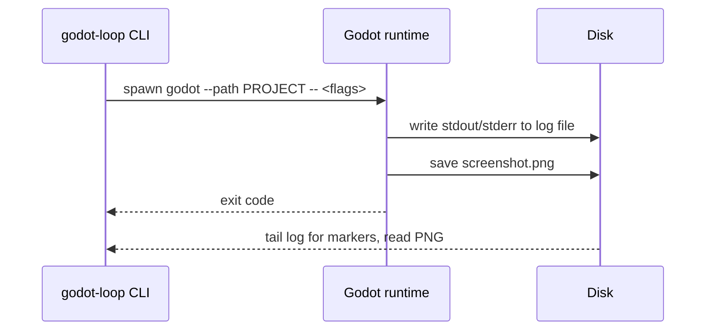
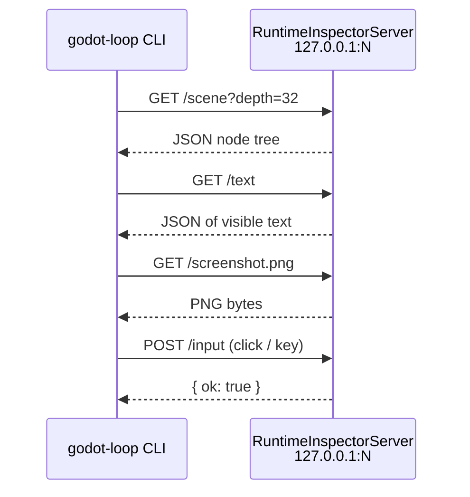
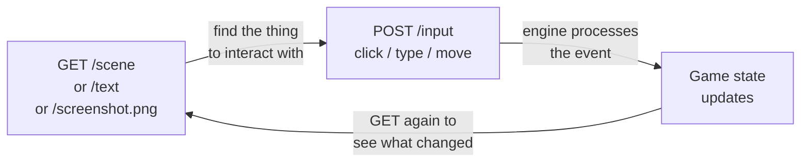

# agentic-godot

End-to-end automation for Godot development — letting coding agents
build, run, and observe live Godot clients.

Currently ships **godot-loop**: a small tool that lets you (or an AI
agent) launch your Godot game, watch what happens, take a screenshot,
and ask questions about what's on screen — all from the command line or
a script.

> **Status**: alpha (0.1).  Stable shape, may rename a few things before 1.0.

## What it does

When you run **`godot-loop run e2e`**, the CLI:

1. Checks your backend is up
2. Launches your game
3. Waits for it to print `"ready"`
4. Takes a screenshot
5. Exits `0` if all good, non-zero if anything failed

That's the basic loop.  When you also pass `--inspect-port`, the game
opens a tiny HTTP server you can talk to while it's running:

```bash
godot-loop inspect --endpoint /scene                       # what's the node tree?
godot-loop inspect --endpoint /text                        # what text is on screen?
godot-loop inspect --endpoint /screenshot.png --save-to now.png
godot-loop input mouse_button --x 400 --y 300              # click here
```

## Why

Unit tests prove pieces of your game work.  They don't prove the **game
itself** works — that it actually starts up, talks to its backend, and
puts the right thing on screen.  godot-loop is the thing you run to
answer "did I just break the game?"

It's three checks, smallest first:

1. **Unit tests** — your existing `*_smoke.gd` files, run headless.
2. **End-to-end** — launch the game, wait for "ready", grab a screenshot.
3. **Live inspection** — talk to the running game over HTTP while it plays.

Use whichever level fits the change.

## Install

```bash
pip install -e /path/to/agentic-godot          # CLI (editable for now)
```

Drop the addon into your Godot project (symlink while you iterate):

```bash
ln -s /path/to/agentic-godot/addon/godot_loop  your-project/addons/godot_loop
```

## Add it to your game

Two small bits of GDScript in your main scene:

```gdscript
extends Node

var launch_config: LoopLaunchConfig

func _ready() -> void:
    launch_config = LoopLaunchConfig.new()
    launch_config.apply_command_line_args(OS.get_cmdline_user_args())

    # Optional: open the inspector if --inspect-port=N was passed.
    if launch_config.inspect_port > 0:
        var inspector := RuntimeInspectorServer.new()
        inspector.setup(launch_config.inspect_port)
        add_child(inspector)

    # ... your normal startup ...

    print("ready")    # godot-loop watches for this in the log
    if launch_config.exit_after_bootstrap:
        await get_tree().create_timer(2.0).timeout
        get_tree().quit()
```

Drop a `godot-loop.toml` at your repo root:

```toml
[project]
path = "path/to/your/godot/project"

[health]
url = "http://127.0.0.1:8000/health"     # optional

[e2e]
launch_args = ["--exit-after-bootstrap"]
log_markers = ["ready"]                  # all must appear in stdout
```

Run it:

```bash
godot-loop run e2e
```

That's the whole flow.

## How it works

There are two ways the driver (the CLI, or anything that knows how to
spawn processes and speak HTTP) talks to your running game.

### 1. Launching the game (one direction)

The CLI runs `godot --path PROJECT --` and passes flags after the `--`.
The addon's `LoopLaunchConfig` reads them inside the running game.
Your code reacts (prints `"ready"`, takes a screenshot, quits).



No network on this path — just files and exit codes.  This is enough to
answer "did my game start up properly?"

### 2. Inspecting the running game (two-way HTTP)

When you pass `--inspect-port=N`, the addon stands up a tiny HTTP server
on `127.0.0.1:N`:



It's plain HTTP because everything already speaks HTTP — `curl`, Python
`requests`, your browser, an LLM tool call.  The whole server is a few
hundred lines of GDScript on top of `TCPServer`.  Bound to localhost
only — it's a debug tool, not a remote control.

### Custom endpoints

You can add your own GET endpoints to expose game-specific state:

```gdscript
inspector.register_provider("/inventory", func() -> Dictionary:
    return {"items": player.inventory})
```

Now `godot-loop inspect --endpoint /inventory` returns whatever you
wrote.  Useful for asserting "is the right thing on screen?" from a
script or an agent.

## Driving the game

The point of `/input` plus the read endpoints is the full **see → act →
see again** loop — what makes the harness usable by an agent (or a
script that wants to act like one):



### How input gets in

`POST /input` builds a real `InputEvent` (one of `InputEventMouseButton`,
`InputEventMouseMotion`, or `InputEventKey`) and calls
`get_tree().get_root().push_input(event)` on it.  That means the event
goes through Godot's normal input pipeline: `Button` nodes fire their
`pressed` signal, `Area2D`/`Area3D` `input_event` works, anything that
listens via `_input()` / `_unhandled_input()` runs.  There's no special
test path — the running game can't tell the click came from the
inspector vs. a real mouse.

Three event types:

| Type | Required | Optional | Effect |
|------|----------|----------|--------|
| `mouse_button` | `button` | `x`, `y`, `pressed` (default `true`) | Press or release a mouse button at viewport coords |
| `mouse_motion` | — | `x`, `y` | Move the mouse to viewport coords |
| `key` | `keycode` | `pressed`, `shift`, `ctrl`, `alt`, `meta` | Press or release a key |

`button` is one of `left`, `right`, `middle`, `wheel_up`, `wheel_down`.
`keycode` accepts an integer or a string Godot recognizes (e.g. `"A"`,
`"Enter"`, `"Space"`).

### Finding what to click

Click coordinates are viewport pixels, not screen pixels.  You usually
don't want to hard-code them — `GET /scene` returns every `Control`'s
`global_pos` and `size`, so a script can look up a node by name and
click its center. The scene endpoints accept `?depth=N` and default to
depth 32 so nested real-game UI remains discoverable without large
unbounded dumps:

```python
import requests
scene = requests.get("http://127.0.0.1:8765/scene?depth=32").json()

def find(node, name):
    if node.get("name") == name:
        return node
    for child in node.get("children", []):
        hit = find(child, name)
        if hit:
            return hit

start = find(scene["root"], "StartButton")
cx = start["global_pos"]["x"] + start["size"]["x"] / 2
cy = start["global_pos"]["y"] + start["size"]["y"] / 2

requests.post("http://127.0.0.1:8765/input", json={
    "type": "mouse_button", "button": "left", "x": cx, "y": cy, "pressed": True,
})
requests.post("http://127.0.0.1:8765/input", json={
    "type": "mouse_button", "button": "left", "x": cx, "y": cy, "pressed": False,
})
```

`POST /input` returns `{"focused": "<NodePath>", ...}` so you can
confirm something actually picked up the event.

### Observing what changed

After input, **give the engine a frame to process** (a single `_process`
tick — usually 16-50 ms is plenty in practice).  Then re-read whichever
endpoint tells you what you care about:

| Question | Endpoint |
|----------|----------|
| Is a particular node visible / where is it? | `GET /scene` |
| Did some text change? | `GET /text` |
| Did a popup appear / does it look right? | `GET /screenshot.png` |
| Did some game-specific state update? | `GET /<your_provider>` |

The CLI's `godot-loop trace` does this for you on a poll: pass
`--endpoint` once or many times, and it prints only when the response
changes — useful for watching a sequence of state transitions live.

### A worked example: click through a menu

```bash
# 1. Launch with the inspector open.
godot-loop run e2e --extra --inspect-port=8765 &
sleep 3

# 2. See what's on screen.
godot-loop inspect --endpoint /text

# 3. Click "Start".
godot-loop input mouse_button --button left --x 640 --y 400

# 4. Confirm the menu went away and the next scene loaded.
sleep 0.2
godot-loop inspect --endpoint /text     # should show different text now
```

Wrap that in a Python script (or hand it to an agent) and you have
end-to-end gameplay automation — drive any flow your real player can.

### Notes

- The inspector lives for the **whole godot run**.  One launch = one
  port; you can issue thousands of requests against it.
- Input is **asynchronous**.  The HTTP call returns once the event was
  pushed; the *consequence* of the event happens on the next frame.
  Give it a beat (`sleep 0.1`) before re-reading state.
- For UI assertions specific to your game, register a provider — it's
  more reliable than scraping `/scene` for node paths that may shift.
- The inspector is **debug-only**.  Don't ship a build with
  `--inspect-port` enabled by default.

## Frequently asked

### How is this different from a Godot MCP server (like `godot-ai`)?

A Godot MCP drives the **editor**, while you're authoring the project —
think "create a Camera2D node, attach this script."  godot-loop drives
the **running game**, after you've launched it — think "did the game
start, what's on screen now, click this button."

|                  | Editor MCP (e.g. godot-ai) | godot-loop                 |
|------------------|---------------------------|----------------------------|
| Talks to         | The Godot editor          | Your running game          |
| When             | While you're building     | While the game is running  |
| Used for         | Authoring scenes/scripts  | Validating + observing     |

They're complementary.  An agent can use an editor MCP to *change* the
project, then use godot-loop to *check* the change still produces a
working game.

### Does it need the editor?

Not for the runtime.  `godot --path PROJECT` (or `--headless`) just
runs your game.

There's one wrinkle: Godot only builds the `class_name` lookup cache
when the editor scans the project, so a fresh checkout (or a new
`class_name` you just added) might fail to start until the cache exists.
The fix is one short editor-headless invocation, usually run once from
the `pre_launch` hook:

```bash
godot --headless --editor --quit-after 200 --path PROJECT
```

After that the cache is on disk and the runtime works alone.

The `/screenshot.png` endpoint also needs a windowed run — `--headless`
has no viewport to capture from.

## MCP server

Run godot-loop as an MCP server so Claude / Codex / any MCP-aware agent can
call its tools directly:

```bash
pip install 'godot-loop[mcp]'
GODOT_LOOP_CONFIG=/path/to/godot-loop.toml godot-loop-mcp
```

Tools exposed: `inspect`, `scene`, `visible_text`, `viewport_info`,
`screenshot`, `find_node`, `click`, `click_node`, `mouse_move`,
`key_press`, `run_e2e`, `run_smoke`, `run_smokes`.

`click_node("StartButton")` is the most useful one — it walks the scene
tree to find a node by name, computes its center, and clicks it.  No
hardcoded coordinates.

## CLI reference

| Command | What it does |
|---------|--------------|
| `godot-loop run e2e` | Launch the game, wait for log markers, capture a screenshot, exit 0/1 |
| `godot-loop run smoke <gd_path>` | Run one `*_smoke.gd` file headless |
| `godot-loop run smokes` | Discover + run every `*_smoke.gd` under the smokes dir |
| `godot-loop rebuild-class-cache` | Headlessly rebuild Godot's `class_name` lookup cache (one-shot fix for fresh checkouts) |
| `godot-loop inspect --endpoint /...` | GET an endpoint from the running inspector |
| `godot-loop trace --endpoint /...` | Poll endpoints, print only when something changed |
| `godot-loop input <type>` | POST a click / mouse-move / keypress to the running game |

All commands accept `--config PATH` to point at a specific
`godot-loop.toml`.  By default they walk up from cwd to find one.

## Addon API

### `LoopLaunchConfig` (`RefCounted`)

Reads command-line flags inside your running game:

| Flag | Field | What it's for |
|------|-------|---------------|
| `--api-base=URL` | `api_base_url` | Backend URL (auto-rewrites `localhost` → `127.0.0.1`) |
| `--access-token=TOKEN` | `bearer_token` | Optional bearer token |
| `--user-dir-tag=TAG` | `user_dir_tag` | Use a per-run `user://` so cached state from another run can't poison this one |
| `--exit-after-bootstrap` | `exit_after_bootstrap` (bool) | Quit once your code signals "ready" |
| `--screenshot-after-ms=N` | `screenshot_after_ms` | Wait this long, then save a screenshot |
| `--screenshot-path=PATH` | `screenshot_path` | Where to save it |
| `--inspect-port=N` | `inspect_port` | Open the HTTP inspector on `127.0.0.1:N` |

Need more flags?  Subclass it.  Call `super()` then walk the same args list.

### `RuntimeInspectorServer` (`Node`)

A tiny HTTP server.  Built-in endpoints:

| Method | Path | What it returns |
|--------|------|------------------|
| GET | `/healthz` | `ok` |
| GET | `/scene` | The node tree (name, type, path, visible, position/size) |
| GET | `/text` | Every visible `Label` / `RichTextLabel` text |
| GET | `/viewport` | Window size, content scale, display info |
| GET | `/screenshot.png` | PNG of the current viewport |
| POST | `/input` | Inject a click, mouse-motion, or key event |

Add your own:

```gdscript
inspector.register_provider("/inventory", func() -> Dictionary:
    return {"items": player.inventory})
```

## Config reference

`godot-loop.toml` (at your repo root):

| Key | Default | What |
|-----|---------|------|
| `[project].path` | required | Path to your Godot project (the dir with `project.godot`) |
| `[project].env_file` | `null` | A `.env` to source for `BACKEND_PORT` etc. |
| `[health].url` | `null` | If set, must respond 2xx before launch |
| `[e2e].launch_args` | `[]` | Extra flags appended after `--` |
| `[e2e].log_markers` | `[]` | Strings that must all appear in stdout |
| `[e2e].screenshot_after_ms` | `12000` | When to capture |
| `[e2e].timeout_seconds` | `60` | Wall-clock timeout |
| `[e2e].headless` | `false` | Force `--headless` (no screenshot) |
| `[user_dir_tag].strategy` | `worktree-basename` | Or `fixed` |
| `[user_dir_tag].prefix` | `loop` | Prepended to the basename |
| `[hooks].pre_launch` | `null` | Script run before every launch |
| `inspect_port` | `null` | Static port; else `BACKEND_PORT + 100` |

## Layout

```
agentic-godot/
├── addon/godot_loop/                    # Godot 4 addon
│   ├── LoopLaunchConfig.gd
│   ├── RuntimeInspectorServer.gd
│   ├── plugin.cfg
│   └── plugin.gd
├── src/godot_loop/                      # Python CLI + MCP server
│   ├── cli.py
│   ├── config.py
│   ├── mcp_server.py
│   ├── runners.py
│   └── utils.py
├── tests/                               # pytest
├── examples/
│   ├── godot-loop.toml                  # sample config
│   └── godot_project/                   # minimal end-to-end demo
└── docs/INTEGRATING.md
```

## Project-specific stuff

godot-loop stays out of project-specific concerns — addon symlinks,
class-cache rebuilds, dev-token minting, custom feature flags.  Put any
of that in a script and point `[hooks].pre_launch` at it.  See
`docs/INTEGRATING.md` for a worked example.

## Contributing

Issues and PRs welcome at
[github.com/Boundless-Studios/agentic-godot](https://github.com/Boundless-Studios/agentic-godot).
The CLI has zero tests today — first contribution is gladly accepted.

## License

MIT.  See [`LICENSE`](LICENSE).
